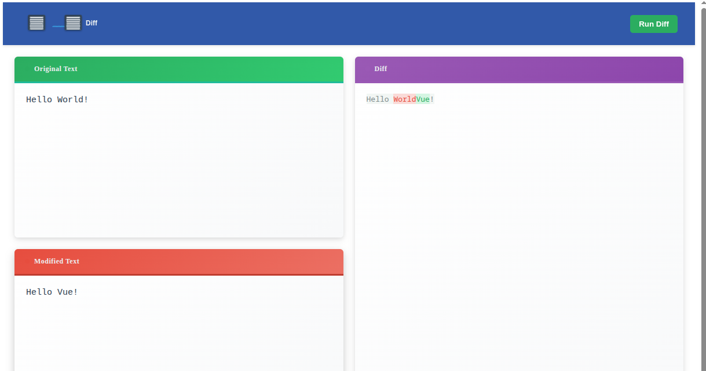

Coding Challenge #125 - Online Diff Viewer
This challenge is to build your own online diff viewer.
John Crickett
Jul 04, 2026

If you’ve ever used GitHub, GitLab, or any code review tool, you’ve seen a diff viewer. It’s the side-by-side or unified view that shows you exactly what changed between two versions of a file - green for additions, red for deletions. But how do these tools actually work? In this challenge you’ll find out by building one yourself. You’ll implement a diff algorithm, render the results in multiple visual formats, and add all the quality-of-life features that make a diff viewer truly useful.

The Challenge - Building Your Own Online Diff Viewer
You’re going to build an online diff viewer that runs entirely in the browser. Users will paste, upload, or drag-and-drop two pieces of text, and your tool will show them exactly what changed. Over several steps you’ll add side-by-side and unified views, syntax highlighting, navigation tools, export options, and accessibility features.

(The challenge): [https://www.linkedin.com/pulse/coding-challenge-125-online-diff-viewer-john-crickett-rgepf/]

12.07.2026 completed step1. See picture:
 
 